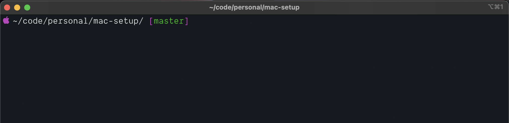
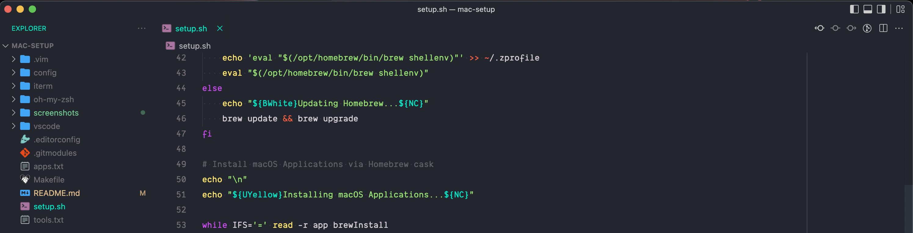

# Setting up a Macbook Pro 

[Installation](#installation)

This repo contains the code to set-up a brand new Macbook Pro with all the apps and tools I use on a day-to-day basis while coding/working.

The `initial-setup.sh` does about 90% of the work. The rest of the work requires entering licensing keys for things like `Alfred` and then syninc our `VS Code` setting by signing in with GitHub.

All the apps and tools are installed using [Homebrew](https://brew.sh/) so this is the first thing installed in the set-up script.

`apps.txt` and `tools.txt` are pretty self-explanatory in that the `app.txt` will install the macOS Applications using Homebrew flag `--cask` and the `tools.txt` will install just normal terminal tools wthout the `--cask` flag.

The format is as follows
```
NAME FOR THE TEMRINAL=homebrew install name
```

```
# Applications Installed
Google Chrome
Slack
Alfred 4
iTerm2
Visual Studio Code
Docker
GPG Keychain
1Password
Discord
Spotify

# Tools Installed
Git
ZSH
Golang
PHP
GitHub CLI
Node
Composer
Tig
PHP Code Sniffer
```
Any application or developer tool that can be installed via `Homebrew` can be installed with this set-up script. Applications **MUST** go inside the `apps.txt` file due to how we run the `brew` command and tools **MUST** go inside the `tools.txt` file.

## Installation

Clone the repo into your `$HOME` directory.

```
git clone --recurse-submodules https://github.com/coderste/mac-setup.git
```

**NB:** You need `git` installed on the environment to run this set-up because we use submodules the folders are not included when download as ZIP from GitHub. Install Xcode Command Line Tools which will give you access to `git`

### GitHub CLI and more

We install and authenticate with the [GitHub CLI](https://github.com/cli/cli) towards the end of the set-up script. This gives us the option to generate a new SSH pubic/private key for the machine we are on and then it will upload the public key for us to our GitHub. This just makes the process of generating a new public/private easier and even less work for us.

## Screenshots of the enviroment
### Terminal Screenshot


### VS Code Screenshot

